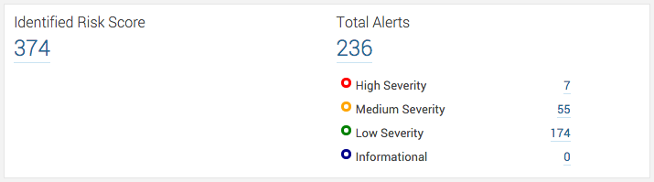

# ZAP Plugin for SonarQube 7.x LTS

[](https://travis-ci.org/OtherDevOpsGene/zap-sonar-plugin)
[](https://www.codacy.com/gh/OtherDevOpsGene/zap-sonar-plugin/dashboard?utm_source=github.com&amp;utm_medium=referral&amp;utm_content=OtherDevOpsGene/zap-sonar-plugin&amp;utm_campaign=Badge_Grade)
[](https://codeclimate.com/github/OtherDevOpsGene/zap-sonar-plugin/maintainability)
[](https://depshield.github.io)
[](https://snyk.io/test/github/OtherDevOpsGene/zap-sonar-plugin)
[](https://www.deepcode.ai/app/gh/OtherDevOpsGene/zap-sonar-plugin/_/dashboard?utm_content=gh%2FOtherDevOpsGene%2Fzap-sonar-plugin)
[](https://lgtm.com/projects/g/OtherDevOpsGene/zap-sonar-plugin/alerts/)
[](https://lgtm.com/projects/g/OtherDevOpsGene/zap-sonar-plugin/context:java)

Integrates [OWASP ZAP](https://www.owasp.org/index.php/OWASP_Zed_Attack_Proxy_Project)
reports into SonarQube v7.x or higher. The target version of SonarQube is the
current LTS version.

## About ZAP

OWASP Zed Attack Proxy (ZAP) is an easy to use integrated penetration testing
tool for finding vulnerabilities in web applications.

People with a wide range of security experience can use ZAP and making it ideal
for developers and functional testers new to penetration testing.

ZAP provides automated scanners as well as a set of tools that allow you to find
security vulnerabilities manually.

## Screenshots



## Metrics

The plugin keeps track of the total number of high, medium, low, and info
severity findings.

Additionally, we define the **Identified Risk Score (IRS)** as

(high &times; 5) + (medium &times; 3) + (low &times; 1)

The IRS is simply a weighted measurement of the vulnerabilities identified
during a scan. It does not measure the actual risk posed by the findings.

## Installation

Copy the plugin (jar file) to `$SONAR_INSTALL_DIR/extensions/plugins` and
restart SonarQube.

## Plugin Configuration

A typical SonarQube configuration will have the following parameters. This
example assumes the use of a Jenkins workspace, but can easily be altered for
other CI/CD systems.

```ini
sonar.zaproxy.reportPath=${WORKSPACE}/zaproxy-report.xml
# Optional - specifies additional rules outside of what's included in the core
sonar.zaproxy.rulesFilePath=${WORKSPACE}/myrules.xml
```

## Compiling

```bash
mvn clean package
```

This will build the plugin into a jar file into `sonar-zap-plugin/target/sonar-zap-plugin-<version>.jar`.

If you set the `docker` property, a Docker image will also be created for testing.
The image will be named `org.sonarsource.owasp/sonar-zap-plugin:<version>` and
will have the `lts` version of SonarQube pulled from Docker Hub with the
newly-built `zap-sonar-plugin` installed.

To always create the Docker image when building locally, you can set the docker
property in an active profile in your `settings.xml`:

```xml
<settings>
...
  <profiles>
    <profile>
      <id>docker</id>
      <properties>
        <docker>true</docker>
      </properties>
    </profile>
  </profiles>

  <activeProfiles>
    <activeProfile>docker</activeProfile>
  </activeProfiles>
...
</settings>
```

## Testing

Once you build the Docker image, you can start it with

```bash
docker run -d --name sonarqube -p 9000:9000 -p 9092:9092 org.sonarsource.owasp/sonar-zap-plugin:version
```

The SonarQube server may take a few minutes to start. You can check the start
process by watching the logs:

```bash
docker logs sonarqube
```

Look for a line that says `SonarQube is up`.

Then run an analysis using the test report:

```bash
mvn sonar:sonar
```

The ZAP results can be viewed at
<http://localhost:9000/project/issues?id=org.sonarsource.owasp%3Asonar-zap-plugin&resolved=false&tags=zaproxy>.
There should be 14 issues: 1 Major, 9 Minor, 4 Info.

## Releasing

You will need a valid code signing key registered with OSSRH.

Once you push the changes, all checks come back clean, and you update the
version number for release, then merge the pull request into `main`.

```bash
git checkout main
git checkout -b release-2.0.2
mvn versions:set -DnewVersion='2.0.2'
git add pom.xml
git commit -m 'Deploying release to Central Repository'
mvn clean deploy -P release
git tag -a sonar-zap-plugin-2.0.2 -m 'Support for SonarQube 7.9 LTS'
mvn versions:set -DnewVersion=2.0.3-SNAPSHOT
git add pom.xml
git commit -m 'Preparing for next development version'
git push origin
git push --tags origin
```

## History

The ZAP SonarQube Plugin is derived from the
[OWASP Dependency-Check SonarQube Plugin](https://github.com/stevespringett/dependency-check-sonar-plugin).
Version 1.0 of the Dependency-Check plugin was [forked](https://github.com/polymont/dependency-check-sonar-plugin)
by @polymont with the intent of creating a generic OWASP SonarQube plugin to
support any OWASP project. The ZAP team wanted their own SonarQube plugin
independent of any other project. In addition, a number of critical defects
were discovered in the initial release of the Dependency-Check SonarQube plugin
that were later fixed in subsequent releases, but never addressed in the generic
OWASP version. The ZAP SonarQube Plugin is based on v1.0.3 of
the Dependency-Check SonarQube plugin with ZAP-specific contributions by @polymont.

## License

Permission to modify and redistribute is granted under the terms of the
[LGPLv3](http://www.gnu.org/licenses/lgpl.txt) license.
