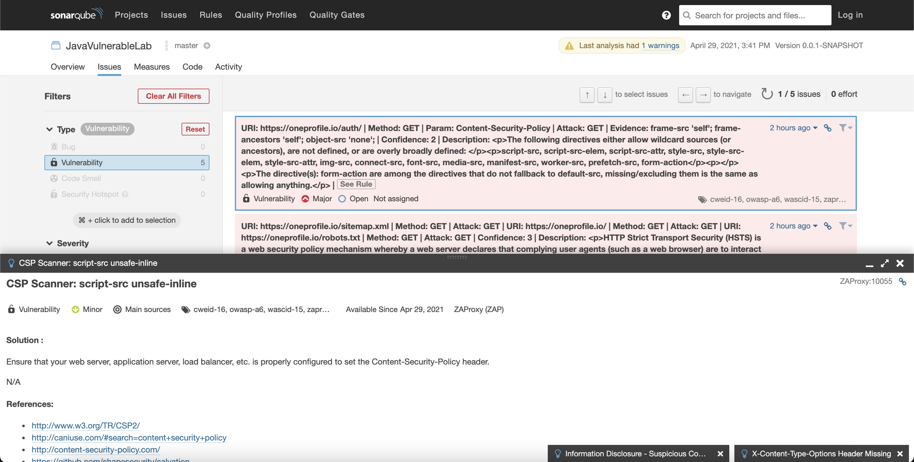

# zap-sonar-plugin-example

## Prerequisites

-   [Git](https://git-scm.com/downloads)
-   [Make](https://www.gnu.org/software/make/)
-   [Docker](https://docs.docker.com/install/) and [docker-compose](https://docs.docker.com/compose/install/)

## Scan the vulnerabilitis with owasp-zap tool

```sh
export PLUGIN_VERSION=2.2.0
export APP_URL_UNDER_TEST='your-url-under-test'
make run
```

or

```sh
docker-compose up -d sonarqube
sleep 120
# wait 2 minute for sonarqbue to start

export PLUGIN_VERSION=2.2.0
wget https://github.com/Coveros/zap-sonar-plugin/releases/download/sonar-zap-plugin-${PLUGIN_VERSION}/sonar-zap-plugin-${PLUGIN_VERSION}.jar -O ./plugin/sonar-zap-plugin-${PLUGIN_VERSION}.jar

export APP_URL_UNDER_TEST='your-url-under-test'
docker-compose up owasp-zap
docker-compose up sonar-scanner
```

Then go to [sonarqube](http://localhost:9000)

Please have a look on `.gitlab-ci.yml` if you wish to run the scan wihtin the Gitlab CI pipeline.

## Vulnerabilities Scan

The Open Web Application Security Project (OWASP) team recommends many [tools](https://www.owasp.org/index.php/Appendix_A:_Testing_Tools) to address security matters, allowing to scan the vulnerabilities of Web Applications.One of the most popular is OWASP `Zed Attack Proxy` (**ZAP**).

## OWASP Zap Tool

The Open Web Application Security Project (OWASP) provides a security tool, called `Zed Attack Proxy` (**ZAP**) to scan the vulnerabilities.


You may download the standalone application [here](https://www.owasp.org/index.php/OWASP_Zed_Attack_Proxy_Project) or use it with CLI.Using the CLI is interesting as in the software industry, we may want to automate to this inside the Continuous Integration (**CI**) toolchain.

OWASP ZAP is one of the most popular security tools and is actively maintained. It comes with a UI and it allows to launch an automated scan against a URL of a web application. It then generate a report.


The generated report is then published to Sonarqube by this hereby plugin. As a result, all metrics related to a software are gathered at one place.

## Quality Metrics

Once this is done, we can see the [vulnerabilities](http://127.0.0.1:9000) metrics on SonarQube.

